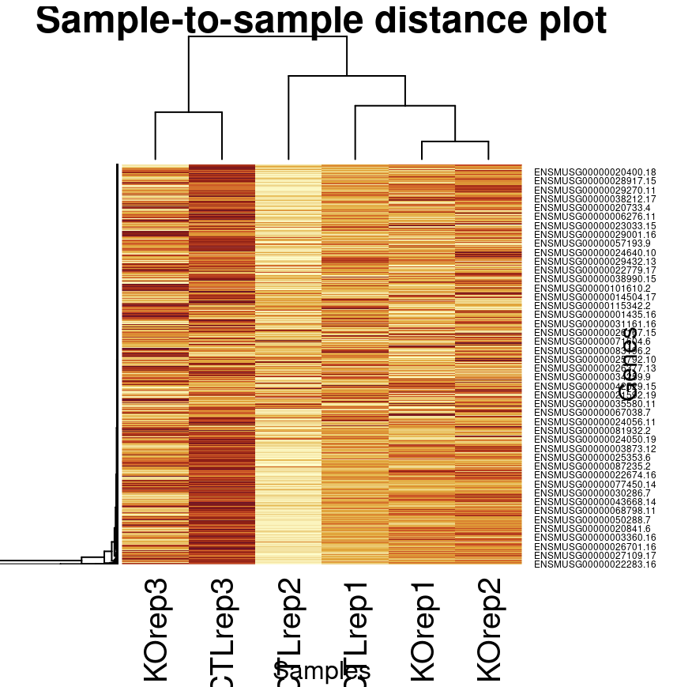

Briefly remark on the quality of the sequencing reads and the alignment statistics, make sure to specifically mention the following:
Sequencing Reads QC:
No concerning aspects were seen regarding quality control of sequencing reads.The duplication rate was high but expected for human data. The mean quality scores (Phred scores) are consistently good (at or above 35), except for the typical initial low scores. The GC content is also consistent across all samples.

Alignment QC:
Aroudn 15% alignemn
No concerning aspects were mentioned related to alignment quality control. The alignment percentage was consistant at approximately 13% across all conditions. There were a large proportion of properly paired reads, minimal secondary alignments, and the absence of duplicate reads.

Sample Exclusion:
Based on the quality control metrics from the "results/multiqc_report.html" and "results/multiqc_report_align.html", there don't seem to be any significant issues that would warrant excluding samples from further analysis.

After generating your counts matrix, perform either a PCA or produce a sample-to-sample distance plot as described in the DESeq2 vignette.
```{r}

```
Briefly remark on the plot and what it indicates to you in terms of the experiment
Generally CTLrep3 is darker than the other samples which indicates a larger proportion of the genes. This means that it has more alignments that fall into exonic regions of the human genome. This ultimately means that CTLrep3 has a much higher mRNA abundance in exonic regions compared to the other samples. However CTLrep2 has the lowest amount of counts with the other four falling at about the same abundance. This could indicate that some biological variation between CTLrep3 and rep2 or could be caused by technical variables.

After performing DE analysis, choose an appropriate FDR threshold to subset your DE results.
I chose to use 0.05 as the FDR threshold.

How many genes are significant at your chosen statistical threshold?
138 genes were significant at FDR < 0.05

FGSEA:
How similar are the results from these two analyses? Are there any notable differences?
There were significant differences in the results. With the FGSEA of all genes there were 1427 pathways while the FGSEA of only the significant genes at FDR < 0.05 had 4 pathways. However, the 2 top pathways in the FGSEA with the subset of DE genes were also present in the signficant pathways of all the genes. 

Do you expect there to be any differences? If so, why?
I expected there to be differences but they were much more different than I had originally thought. The difference is probably due to the constraint on the statistical threshold in subsetting the DE genes.

What do the results imply about potentional biological functions of the factor of interest?
The 2 pathways that were the same in the tests were MIKKELSEN_MEF_HCP_WITH_H3K27ME3 and NABA_MATRISOME. 
The first pathway, MIKKELSEN_MEF_HCP_WITH_H3K27ME3, suggests a role in epigenetic regulation and potentially influences cell differentiation and development. The second pathway, NABA_MATRISOME, indicates involvement in ECM formation, tissue homeostasis, and cell-cell communication. These findings imply a possible biological function in controlling gene expression, tissue structure, and intercellular signaling.