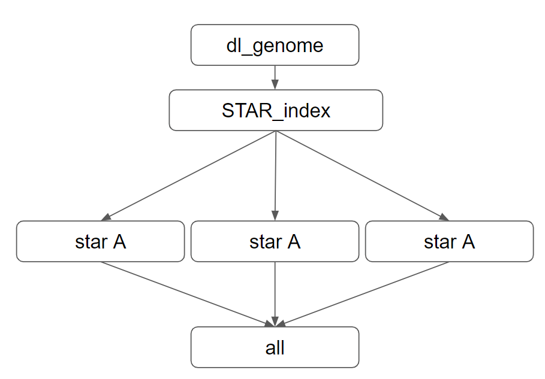
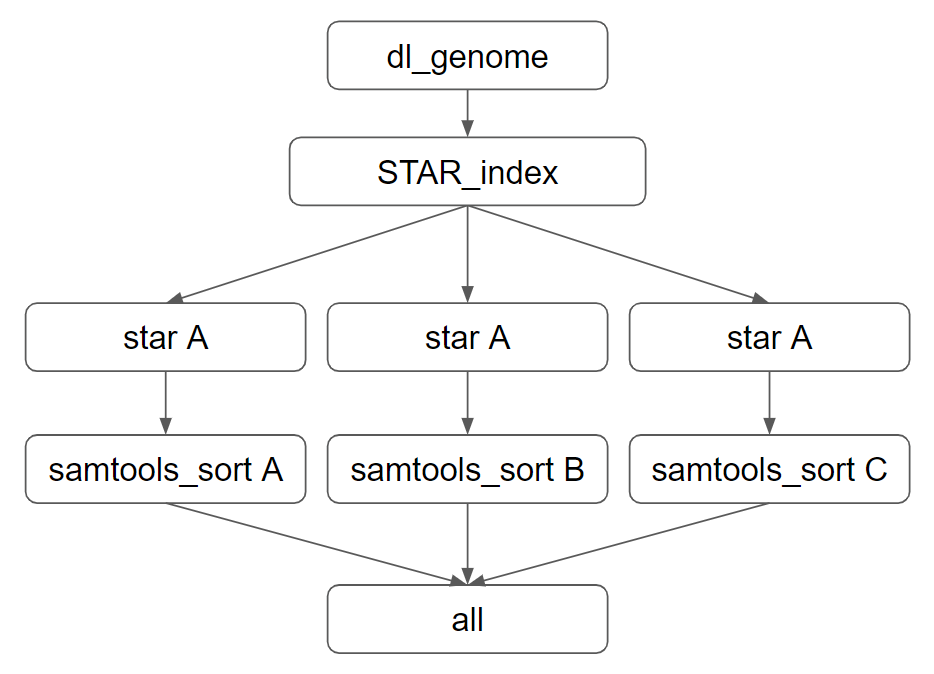
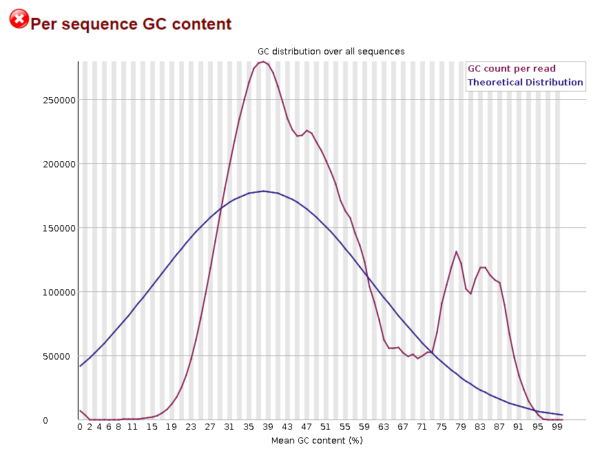

# Project 1 - Discussion Questions

## Snakemake
Consider the following sample snakemake workflow and assume the files A.fq,
B.fq, and C.fq exist in the current working directory. (N.B. Some of these
commands in shell may not technically run, but the logic of the snakefile is
correct)

```
fa_fn = ‘ncbi_dataset/data/GCF_000001635.27/chr19.fa
gtf_fn= ‘ncbi_dataset/data/GCF_000001635.27/genomic.gtf
star_index = ‘Chr19_STAR_index’
FILES = [‘A’, ‘B’, ‘C’]

rule all:
	input:
		expand(‘{sample}.Aligned.out.bam’, sample=FILES)

rule dl_genome:
	output:
		fa = fa_fn,
		gtf = gtf_fn
	shell:
		‘’’
		datasets download genome accession GCF_000001635.27 
    –include gtf, genome
    –chromosomes 19
    
		unzip ncbi_dataset.zip
		‘’’

rule STAR_index:
	input:
		fa = fa_fn,
		gtf = gtf_fn,
	output:
		index=directory(star_index)
	threads: 4
	shell:
		‘’’
		STAR –runMode genome generate \
		–genomeDir {output.index} \
		–genomeFastaFiles {input.fa} \
		–sjdbGTFfile {input.gtf}
		‘’’
		
rule star:
	input:
		fq=’{sample}.fq’,
		index=’Chr19_STAR_index’
	output:
		‘{sample}.Aligned.out.bam’
	params:
		prefix = ‘{sample}.’
	shell:
		‘’’
		STAR –genomeDir {input.index} \
    –readFilesIn {input.fq} \
    –outSAMtype BAM Unsorted \
    –outFileNamePrefix {params.prefix}
    ‘’’
```
1. We’ve talked in class about how you can represent snakemake workflows visually.
Technically speaking, snakemake creates a directed acyclic graph that represents
the workflow. Draw the DAG for this sample snakemake workflow. Boxes indicate
the rules, and arrows indicate dependencies. Make this diagram in whatever
software you'd like and save it to this repo. Fill in the following code with the
name of the file you created and it will display it here in this markdown.
```{r}

```


2. Write a valid snakemake rule that would run samtools sort on the outputs from
rule star. Name the outputs of this rule with the extension _sorted.bam.
```
rule samtools_sort:
    input:
        bam="{sample}.Aligned.out.bam"
    output:
        sorted_bam="{sample}_sorted.bam"
    params:
        sorted_prefix="{sample}_sorted"
    shell:
        """
        samtools sort -o {output.sorted_bam} {input.bam}
        """
```

3. Assume that we change our rule all input to be the following:
	
		expand(‘{samples}_sorted.bam’, samples=FILES)	

Re-draw the DAG assuming your rule from part 2 works as expected. Display it 
here using the following code:
```{r}

```

## RNAseq
1. List the major high-level steps of a basic RNAseq experiment to look for
differentially expressed genes. At each step, list what data you need to perform
each step and what format they are in (if applicable). At minimum, there are 4
essential steps.

```
Data Quality Control (FastQC and MultiQC):
Data Input: Raw RNA-seq reads generated by sequencing platforms
Format: FASTQ format (fastq.gz)

Sequence Alignment (STAR):
Data Input 1: Genome Assembly File
Format 1: Gzipped FASTA format (fa.gz)
Data Input 2: Annotated Genome File
Format 2: GTF format (.gtf)
Data Input 3: Paired-end RNA-seq Reads
Format 3: FASTQ format (fastq.gz)

Quality Assessment of Alignment (Samtools):
Data Input: Aligned Sequencing Files
Format: BAM format (Aligned.out.bam)

Count Alignments (Verse):
Data Input 1: Aligned Sequencing Files
Format 1: BAM format (Aligned.out.bam)
Data Input 2: Annotated Genome File
Format 2: GTF format (.gtf)

Create and Filter Single Counts Matrix:
Data Input: Exon Verse Expression Files
Format: Text file (.txt)

Extract Mappings from GTF File:
Data Input: Annotated Genome File
Format: GTF format (.gtf)

Differential Expression Analysis:
Data Input 1: Filtered Single Counts Matrix
Format: Matrix Format (.csv)
Data Input 2: Mapping of Trasncript IDs to Gene Symbols
Format 2: Text file (.txt)
```

2. Consider the following FastQC plot.
```{r}

```

2a. What aspect of the data does this plot show?
```
This plot is visualizing the distribution of GC content across reads in a sequence data set compared to a theoretical distribution.
```

2b. Make an interpretation of this plot assuming the data type was RNASeq.
```
There is an expected high spike at around 40% but is much higher than the theoretical distribution. Another interesting feature is at the 80-90% range as there is another spike that is unexpected in comparison to the theoretical. This could indicate potential bias or issues with the data.
```

2c. Do you think this plot indicates there was a problem with the dataset?
Explain your answer.
```
Yes, this plot could indicate there is a probelm with the dataset due to the unexpected spike at the 80-90% range when the theoretical expectation is a concentration at 40%. A higher than expected GC content could indicate technical issues during preparation or sequencing such as PCR bias or contamination.
```

3. What is a splice-aware aligner? When is it important to use a splice-aware
aligner?
```
A splice-aware aligner is software designed to consider splice junctions and alternative splicing events. Specifically for RNAseq, these aligners consider the presence of introns and the splicing process when mapping RNA-seq reads to a reference genome. This means splice-aware aligners are especially important for RNAseq to accurately align reads.
```

4. What does a “gene-level” count as produced by VERSE or any other counting
tool in a RNAseq experiment represent?
```
The VERSE output is an exon verse expression file that represents gene-level counts. These counts are derived from the alignment of sequencing reads to each gene in the genome. Each count in this file quantitatively measures the expression level of the corresponding gene in the sample. Specifically, the count for a particular gene indicates the number of sequencing reads that originated from that gene, providing insights into its transcriptional activity within the biological sample being studied.
```

5. In your own words, briefly describe what information the matching GTF for a
reference genome stores.
```
A GTF file for a reference genome stores information about the gene and transcript features annotated on the genome. It contains details such as the genomic coordinates of genes, exons, transcripts, and other features, along with additional information such as gene and transcript identifiers, gene names, strand orientation, and functional annotations.
```

6. When counting alignments using VERSE or any other utility, why do we need to
provide the matching reference genome GTF file?
```
Providing the matching reference genome GTF file is necessary for accurately assigning sequencing reads to specific genomic regions, identifying splice junctions, and quantifying gene expression levels during the alignment and counting process in RNA-seq analysis.
```

7. Let’s pretend that this was a GSEA result from an experiment where we treated
293T cells with a drug and compared changes in gene expression to wild-type
cells treated with a vehicle control. The differential expression results are
relative to the control cells (i.e. a positive fold change means a gene is
upregulated upon treatment with the drug)

Assume the following result is statistically significant with a positive NES
(normalized enrichment score) and that it represents a GSEA experiment performed
on the entire list of genes discovered in the experiment ranked by
log2FoldChange (i.e. genes that are “upregulated” in the cells treated with drug
are on the “left” and genes that are “downregulated” due to treatment are on the
“right”).
```{r}
knitr::include_graphics("gsea_plot.png")
```

7a. Form a valid interpretation/conclusion of the results shown in the plot
given the above setup.
```
The gene set is unregulated in comparison to the ranked list. It is very positively correlated which indicates a strong correlation with with the drug treatment meaning there is a significant coordinated change in gene expression associated with the gene set identified.
```

7b. Now consider that all of the genes driving the enrichment are all activators
of the inflammatory pathway. Does your interpretation change and if so, how?
```
My previous interpreation expresses that there is a significant change in gene expression so my interpretation would not change. The highly positive correlation of the gene set with a high enrichment score indicates a significant activation of the inflammatory pathway in response to the drug treatment. This means that the drug is inducing inflammation response. This could indicate that the cell is having a robust immune response.
```

7c. Finally, consider that all of the genes driving the enrichment all function
to inhibit inflammation. Does your interpretation change and if so, how?
```
Yes this would change the previous interpretation because the highly positive correlation of the gene set with a high enrichment score indicates a significant inhibition of the inflammatory pathway in response to the drug treatment. This means that the drug is reducing inflammation response and could indicate that the cell is repressing the immune response.
```

## O’Meara et al. Transcriptional Reversion of Cardiac Myocyte Fate During
Mammalian Cardiac Regeneration. Circ Res. Feb 2015. PMID: 25477501
1. Write out a methods section describing what steps of the analysis you performed
and which tools you used. Style this section as you would find a methods section
in a scientific publication. Remember to include the important details that
would allow a third party to reproduce your exact analysis. You can safely
exclude details that do not affect the underlying results.
```
The analysis was conducted in high-performance computing environments. Specifically utilizing Miniconda, Github, and the Boston University Shared Computing Cluster (SCC), which provided the necessary computational resources. Focusing on the data from the first figure of the reference study (O’Meara), specifically the dataset involving samples from p0, p4, p7, and adult mouse heart ventricle cells. This subset consisted of 8 samples each paired end reads, encompassing 16 individual FASTQ files.

Data Quality Control (FastQC and MultiQC):
The analysis pipeline incorporated FastQC(v0.12.1), a bioinformatics software tool, for quality control on the FastQ files. FastQC performs quality control assessments on sequence data. The goal was to swiftly assess the basic quality of the sequencing data. A Snakemake workflow was developed to automate the execution of FastQC on each of the 16 project files. MultiQC(v1.17) was utilized to compile the separate FastQC outputs into a unified, well-organized, and visually engaging report. This tool provided a comprehensive overview of quality metrics across all samples. This analysis was completed in approximately 15 minutes.

Sequence Alignment and Quality Assessment of Alignment:
The pipeline also incorporated STAR(v2.7.10b), another bioinformatics software tool, for aligning the paired-end RNAseq reads to the genome. Star uses a genome assembly file and annotated genome file to align the reads onto. These were obtained from the GENCODE website. Specifically, the Genome sequence, primary assembly (GRCm39) for mice with its matching annotation file. Star continues by outputting the aligned sequence files in the BAM format which Samtools Flagstats(v1.6) is used to assess the qulity of the alignment. This analysis was completed in approximately 50 minutes.

Count Alignments, Single Counts Matrix, and Mappings:
Verse(v0.1.5), another bioinformatics software tool, was used to perform gene set enrichment analysis (GSEA) on the RNAseq data. It assesses whether a predefined set of genes shows statistically significant differences in expression between experimental conditions. The output is a exon verse expression file which was then used to create and filter a single counts matrix for furutre differencial expression analysis. Along with the single counts matrix, the mappings from the annotated genome must be extracted. This was also done using a snakemake workflow and was completed in approximately 20 minutes.

Differential Expression Analysis:
Using R(v4.3.1), the following packages were used for the differential expression analysis: DESeq2(v1.36.0), tidyverse(v2.0.0), and data.table(v1.14.2). The single counts matrix from the verse analysis were parsed to contain the sample data with the timepoints for the samples. Specifically, looking to compare the undifferentiated (p0) myocytes with the fully differentiated (AD) to see which genes groups change over time. DESeq2, a bioinformatics tool widely accepted for differential expression using counts data, was used to test for differental expression. DESeq2 conducts normalization automatically and employs generalized linear models to assess differential expression. The extracted mappings from the annoated genome were read in to add the associated gene name. Again using R and the fgsea package(v1.22.0) and using an FDR threshold of < 0.25, a fGSEA analysis was performed to identify biological pathways associated with observed gene expression changes.This analysis was completed in approximately 5 minutes. 
```

2. Why did the authors perform RNAseq on these specific samples? What was their
goal in doing so?
```
The authors performed RNAseq on the samples at p0, p4, p7, and adult of the heart ventricle. The goal was to find any changes in the transcriptional expression throughout mice heart maturation. P indicates post-natal and the number following indicates the days after birth. The heart ventricle was used as neonatal mice were seen to be able to regenerate their heart after the removal of the left ventricular apex. The apex of the heart is made of the left and right ventricles, thus making them the best choice for RNAseq and further analysis.
```

3. Using either your GSEA results OR your replication of Figure 1D, draw a conclusion
about the main result this RNAseq experiment shows. Do your results generally
agree with those of the original publication?
```
Mitocondria and Sacramere assembly were up-regulated. Yes, these results do generally agree with the original publication. 
```

4. List at least two reasons why your results may be **slightly** different than
those found in the original publication.
```
Differences in software versions utilized within the pipeline compared to those documented in the paper may result in slight variations in outcomes. Also, inherent random elements within DESeq2 may contribute to minor discrepancies among different users. The alignment process was conducted using STAR(v2.7.10b), which aligns RNA-seq reads to the genome using a genome assembly file (GRCm39) and annotated genome file obtained from the GENCODE website. Differences in the alignment parameters or using different versions of the reference genome assembly and annotations compared to those used in the original publication could lead to variations in the alignment results.
```
